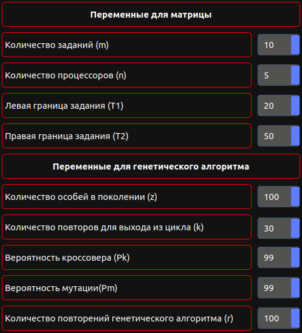
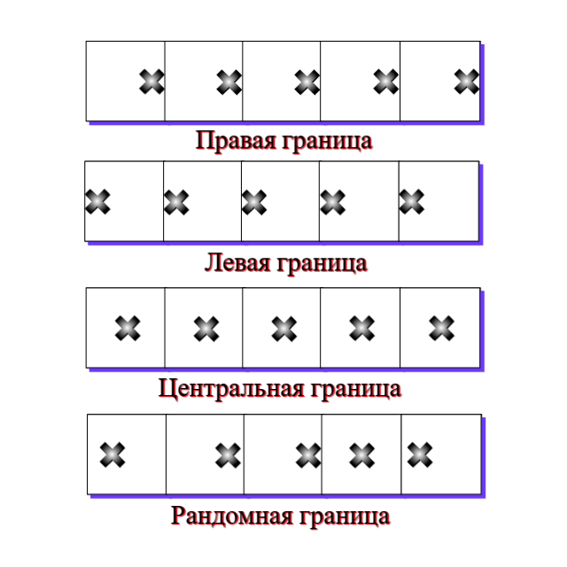

# Вступление
Суть исследования выяснить при каком разбиении начального поколения, формировании гена относительно границ, и сортировке матрицы критерий минемакса окажется наилучшим.

В рамках опыта формируются 100 матриц случайным образом одинаковой размерности.

Рассматриваются случаи при формировании начального поколения:

1. Влияние расположение гена относительно границ в процессорах
2. Влияние сортировки матрицы
3. Влияние пропорционального разбиения (количество методов, детерминированно или нет)

> Исследование проведено на следующих тестовых данных:



# В каких случаях генетический алгоритм лучше работает?
## 1. Методы разбиения начального поколения.
### 1.1 Метод минимальных элементов 25% + Метод Плотникова-Зверева 25% + Метод Барьера 25% + Метод рандомного формирования 25%

### 1.2 Метод минимальных элементов 32% + Метод Плотникова-Зверева 31% + Метод Барьера 32% + Метод рандомного формирования 5%

### 1.3 Метод минимальных элементов 5% + Метод Плотникова-Зверева 5% + Метод Барьера 5% + Метод рандомного формирования 85%

### 1.4 Метод минимальных элементов 33% + Метод Плотникова-Зверева 33% + Метод Барьера 34%

### 1.5 Метод минимальных элементов 50% + Метод Плотникова-Зверева 50%

### 1.6 Метод рандомного формирования 100%

### 1.7 Метод Барьера 100%

### 1.8 Метод Плотникова-Зверева 5% + Метод рандомного формирования 95%

### 1.9 Метод минимальных элементов 5% + Метод рандомного формирования 95%

### 1.10 Метод Барьера 5% + Метод рандомного формирования 95%

## 2. Границы - расположение гена относительно границ в процессорах:



# 3. Результаты исследования
## 3.1 Результаты по сортированной по возрастанию матрице

```*MМЭ - Метод Минимальныъ Элементов```

```*МПЗ - Метод Плотникова-Зверева```

```*МБ - Метод Барьера```

```*МРФ - Метод Рандомного Формирования```

> f - критерий минимакса

> t - время затраченное на выполнение

| №  | <span style="color:red">Разбиение    | <span style="color:green">Левая(f) | <span style="color:green"> Правая(f) | <span style="color:green">Центральная(f) | <span style="color:green">Рандомная(f) | Общий<br/>результат | <span style="color:green">Левая(t) | <span style="color:green">Правая (t) | <span style="color:green">Центральная(t) | <span style="color:green">Рандомная(t) | Общее<br/>время |
|----|--------------------------------------|------------------------------------|--------------------------------------|------------------------------------------|----------------------------------------|---------------------|------------------------------------|--------------------------------------|------------------------------------------|----------------------------------------|-----------------|
| 1  | ММЭ 5% + МРФ 95%                     | 62.23                              | 62.61                                | 62.44                                    | 61.58                                  | 248.86              | 109                                | 103                                  | 102                                      | 97                                     | 411             |
| 2  | МБ 5% + МРФ 95%                      | 63.10                              | 62.64                                | 62.07                                    | 61.90                                  | 249.51              | 99                                 | 92                                   | 92                                       | 90                                     | 373             |
| 3  | ММЭ 5% + МПЗ 5% + МБ 5% + МРФ 85%    | 63.90                              | <span style="color:yellow">61.55     | 62.35                                    | 62.12                                  | 249.92              | 93                                 | 78                                   | 77                                       | 76                                     | 324             |
| 4  | МПЗ 5% + МРФ 95%                     | 62.83                              | 62.98                                | 62.74                                    | 62.58                                  | 251.13              | 111                                | 103                                  | 103                                      | 102                                    | 419             |
| 5  | МРФ 100%                             | 62.38                              | 63.40                                | 62.91                                    | 63.13                                  | 251.82              | 104                                | 93                                   | 90                                       | 90                                     | 377             |
| 6  | ММЭ 25% + МПЗ 25% + МБ 25% + МРФ 25% | 66.40                              | 62.30                                | 64.69                                    | 63.82                                  | 257.21              | 164                                | 144                                  | 139                                      | 125                                    | 572             |
| 7  | ММЭ 32% + МПЗ 31% + МБ 32% + МРФ 5%  | 70.41                              | 63.60                                | 65.56                                    | 66.27                                  | 265.84              | 174                                | 157                                  | 140                                      | 138                                    | 609             |
| 8  | ММЭ 33% + МПЗ 33% + МБ 34%           | 76.49                              | 63.97                                | 66.22                                    | 65.60                                  | 272.78              | 173                                | 159                                  | 153                                      | 127                                    | 612             |
| 9  | ММЭ 50% + МПЗ 50%                    | 78.78                              | 63.60                                | 68.50                                    | 68.46                                  | 279.34              | 165                                | 155                                  | 153                                      | 151                                    | 624             |
| 10 | МБ 100%                              | 87.65                              | 66.23                                | 70.12                                    | 70.47                                  | 294.17              | 200                                | 178                                  | 175                                      | 166                                    | 719             |.

<span style="color:yellow"><small> Жёлтым </span> помечен лучший результат </small>

---
## 3.2 Результаты по сортированной по убыванию матрице

```*MМЭ - Метод Минимальныъ Элементов```

```*МПЗ - Метод Плотникова-Зверева```

```*МБ - Метод Барьера```

```*МРФ - Метод Рандомного Формирования```

> f - критерий минимакса

> t - время затраченное на выполнение

| №  | <span style="color:red">Разбиение    | <span style="color:green">Левая(f) | <span style="color:green"> Правая(f) | <span style="color:green">Центральная(f) | <span style="color:green">Рандомная(f) | Общий<br/>результат | <span style="color:green">Левая(t) | <span style="color:green">Правая (t) | <span style="color:green">Центральная(t) | <span style="color:green">Рандомная(t) | Обшее<br/>время |
|----|--------------------------------------|------------------------------------|--------------------------------------|------------------------------------------|----------------------------------------|---------------------|------------------------------------|--------------------------------------|------------------------------------------|----------------------------------------|-----------------|
| 1  | ММЭ 5% + МПЗ 5% + МБ 5% + МРФ 85%    | 62.15                              | <span style="color:yellow">60.28     | <span style="color:yellow">59.71         | <span style="color:yellow">60.59       | 242.73              | 106                                | 90                                   | 89                                       | 89                                     | 374             |
| 2  | МБ 5% + МРФ 95%                      | 62.99                              | 61.22                                | 61.11                                    | <span style="color:yellow">60.60       | 245.92              | 98                                 | 87                                   | 87                                       | 86                                     | 358             |
| 3  | МПЗ 5% + МРФ 95%                     | 62.79                              | 61.99                                | 61.70                                    | <span style="color:yellow">60.95       | 247.43              | 102                                | 92                                   | 91                                       | 91                                     | 376             |
| 4  | ММЭ 5% + МРФ 95%                     | 63.21                              | 61.56                                | 61.41                                    | 61.87                                  | 248.05              | 143                                | 111                                  | 110                                      | 98                                     | 462             |
| 5  | ММЭ 25% + МПЗ 25% + МБ 25% + МРФ 25% | 66.09                              | <span style="color:yellow">60.9      | 61.52                                    | 63.14                                  | 251.65              | 146                                | 129                                  | 114                                      | 108                                    | 497             |
| 6  | МРФ 100%                             | 63.36                              | 63.42                                | 63.52                                    | 62.76                                  | 253.06              | 160                                | 130                                  | 120                                      | 114                                    | 524             |
| 7  | ММЭ 32% + МПЗ 31% + МБ 32% + МРФ 5%  | 70.02                              | 61.18                                | 62.16                                    | 62.60                                  | 255.96              | 161                                | 140                                  | 134                                      | 93                                     | 528             |
| 8  | ММЭ 33% + МПЗ 33% + МБ 34%           | 76.79                              | <span style="color:yellow">60.52     | 62.05                                    | 61.85                                  | 261.21              | 168                                | 145                                  | 144                                      | 138                                    | 595             |
| 9  | ММЭ 50% + МПЗ 50%                    | 79.66                              | 64.68                                | 62.22                                    | 64.08                                  | 270.44              | 160                                | 158                                  | 152                                      | 146                                    | 616             |
| 10 | МБ 100%                              | 91.96                              | 64.84                                | 65.36                                    | 65.89                                  | 288.05              | 210                                | 207                                  | 202                                      | 134                                    | 753             |

<span style="color:yellow"><small> Жёлтым </span> помечены лучшие результаты </small>

## 3.3 Результаты по неотсортированной по матрице

```*MМЭ - Метод Минимальныъ Элементов```

```*МПЗ - Метод Плотникова-Зверева```

```*МБ - Метод Барьера```

```*МРФ - Метод Рандомного Формирования```

> f - критерий минимакса

> t - время затраченное на выполнение

| №  | <span style="color:red">Разбиение    | <span style="color:green">Левая(f) | <span style="color:green"> Правая(f) | <span style="color:green">Центральная(f) | <span style="color:green">Рандомная(f) | Общий<br/>результат | <span style="color:green">Левая(t) | <span style="color:green">Правая (t) | <span style="color:green">Центральная(t) | <span style="color:green">Рандомная(t) | Обшее<br/>время |
|----|--------------------------------------|------------------------------------|--------------------------------------|------------------------------------------|----------------------------------------|---------------------|------------------------------------|--------------------------------------|------------------------------------------|----------------------------------------|-----------------|
| 1  | МБ 5% + МРФ 95%                      | 61.35                              | <span style="color:yellow">58.94     | <span style="color:yellow">58.92         | <span style="color:yellow">58.98       | 238.18              | 78                                 | 75                                   | 74                                       | 74                                     | 301             |
| 2  | ММЭ 5% + МПЗ 5% + МБ 5% + МРФ 85%    | 61.77                              | <span style="color:yellow">58.98     | <span style="color:yellow">59.0          | <span style="color:yellow">59.0        | 238.75              | 90                                 | 74                                   | 74                                       | 73                                     | 311             |
| 3  | ММЭ 25% + МПЗ 25% + МБ 25% + МРФ 25% | 63.34                              | <span style="color:yellow">59.0      | <span style="color:yellow">59.0          | <span style="color:yellow">59.0        | 240.34              | 92                                 | 74                                   | 74                                       | 73                                     | 313             |
| 4  | ММЭ 5% + МРФ 95%                     | <span style="color:yellow">60.03   | <span style="color:yellow">60.12     | 61.72                                    | <span style="color:yellow">59.97       | 241.84              | 88                                 | 75                                   | 75                                       | 74                                     | 312             |
| 5  | ММЭ 32% + МПЗ 31% + МБ 32% + МРФ 5%  | 67.37                              | <span style="color:yellow">59.0      | <span style="color:yellow">59.0          | <span style="color:yellow">59.0        | 244.37              | 96                                 | 78                                   | 77                                       | 76                                     | 327             |
| 6  | МРФ 100%                             | 61.33                              | 61.87                                | 61.65                                    | 61.65                                  | 246.5               | 94                                 | 74                                   | 74                                       | 73                                     | 315             |
| 7  | ММЭ 33% + МПЗ 33% + МБ 34%           | 69.56                              | <span style="color:yellow">59.0      | <span style="color:yellow">59.0          | <span style="color:yellow">59.0        | 246.56              | 100                                | 100                                  | 100                                      | 98                                     | 398             |
| 8  | МПЗ 5% + МРФ 95%                     | 61.31                              | 62.11                                | 61.77                                    | 61.89                                  | 247.08              | 100                                | 99                                   | 97                                       | 96                                     | 392             |
| 9  | МБ 100%                              | 72.0                               | <span style="color:yellow">59.0      | <span style="color:yellow">59.0          | <span style="color:yellow">59.0        | 249                 | 158                                | 143                                  | 100                                      | 86                                     | 487             |
| 10 | ММЭ 50% + МПЗ 50%                    | 74.36                              | 65.0                                 | 63.02                                    | 65.0                                   | 267.38              | 156                                | 137                                  | 107                                      | 95                                     | 495             |

<span style="color:yellow"><small> Жёлтым </span> помечены лучшие результаты </small>


---

## 3.4 Результаты разбиения (относительно сортировок и в общем)

```*MМЭ - Метод Минимальныъ Элементов```

```*МПЗ - Метод Плотникова-Зверева```

```*МБ - Метод Барьера```

```*МРФ - Метод Рандомного Формирования```

| №  | <span style="color:red">Разбиение    | <span style="color:red">Средний по возрастанию | Общий по возрастанию                  | <span style="color:red">Средний по убыванию                     | Общий по убыванию                     | <span style="color:red">Средний по неотсортированной              | Общий по неотсортированной            | Общий результат                       | <span style="color:red"> Средний результат                       |
|----|--------------------------------------|------------------------------------------------|---------------------------------------|-----------------------------------------------------------------|---------------------------------------|-------------------------------------------------------------------|---------------------------------------|---------------------------------------|------------------------------------------------------------------|
| 1  | ММЭ 5% + МПЗ 5% + МБ 5% + МРФ 85%    | <div style="text-align:center">62.48           | <div style="text-align:center">251.13 | <span style="color:yellow"><div style="text-align:center">60.68 | <div style="text-align:center">242.73 | <span style="color:yellow"><div style="text-align:center">59.6875 | <div style="text-align:center">238.75 | <div style="text-align:center">732.61 | <span style="color:yellow"><div style="text-align:center">61.05  |
| 2  | МБ 5% + МРФ 95%                      | <div style="text-align:center">62.38           | <div style="text-align:center">249.92 | <div style="text-align:center">61.48                            | <div style="text-align:center">245.92 | <span style="color:yellow"><div style="text-align:center">59.545  | <div style="text-align:center">238.18 | <div style="text-align:center">734.02 | <span style="color:yellow"><div style="text-align:center">61.168 |
| 3  | ММЭ 5% + МРФ 95%                     | <div style="text-align:center">62.215          | <div style="text-align:center">248.86 | <div style="text-align:center">62.01                            | <div style="text-align:center">248.05 | <div style="text-align:center">60.46                              | <div style="text-align:center">241.84 | <div style="text-align:center">738.75 | <div style="text-align:center">61.562                            |
| 4  | МПЗ 5% + МРФ 95%                     | <div style="text-align:center">62.78           | <div style="text-align:center">249.51 | <div style="text-align:center">61.86                            | <div style="text-align:center">247.43 | <div style="text-align:center">61.77                              | <div style="text-align:center">247.08 | <div style="text-align:center">744.02 | <div style="text-align:center">62.001                            |
| 5  | МРФ 100%                             | <div style="text-align:center">62.955          | <div style="text-align:center">251.82 | <div style="text-align:center">63.27                            | <div style="text-align:center">253.06 | <div style="text-align:center">61.513                             | <div style="text-align:center">246.05 | <div style="text-align:center">750.03 | <div style="text-align:center">62.502                            |
| 6  | ММЭ 25% + МПЗ 25% + МБ 25% + МРФ 25% | <div style="text-align:center">64.3            | <div style="text-align:center">257.21 | <div style="text-align:center">63.27                            | <div style="text-align:center">253.06 | <span style="color:yellow"><div style="text-align:center">60.085  | <div style="text-align:center">240.34 | <div style="text-align:center">750.61 | <div style="text-align:center">62.550                            |
| 7  | ММЭ 32% + МПЗ 31% + МБ 32% + МРФ 5%  | <div style="text-align:center">66.46           | <div style="text-align:center">265.84 | <div style="text-align:center">63.99                            | <div style="text-align:center">255.96 | <div style="text-align:center">61.0925                            | <div style="text-align:center">244.37 | <div style="text-align:center">766.17 | <div style="text-align:center">63.8475                           |
| 8  | ММЭ 33% + МПЗ 33% + МБ 34%           | <div style="text-align:center">68.2            | <div style="text-align:center">272.78 | <div style="text-align:center">65.3                             | <div style="text-align:center">261.21 | <div style="text-align:center">61.64                              | <div style="text-align:center">246.56 | <div style="text-align:center">780.55 | <div style="text-align:center">65.046                            |
| 9  | ММЭ 50% + МПЗ 50%                    | <div style="text-align:center">69.84           | <div style="text-align:center">279.34 | <div style="text-align:center">67.61                            | <div style="text-align:center">270.44 | <div style="text-align:center">66.845                             | <div style="text-align:center">267.38 | <div style="text-align:center">817.16 | <div style="text-align:center">68.097                            |
| 10 | МБ 100%                              | <div style="text-align:center">73.54           | <div style="text-align:center">294.17 | <div style="text-align:center">72.01                            | <div style="text-align:center">288.05 | <div style="text-align:center">62.25                              | <div style="text-align:center">249    | <div style="text-align:center">831.22 | <div style="text-align:center">69.267                            |

<span style="color:yellow"><small> Жёлтым </span> помечены лучшие результаты </small>

---

## 3.5 Результаты границ (относительно сортировок и в общем)
Под общим подразумеваются сумма всех методов по данной границе

Среднее же это сумма делённая на их количество.

| № | Границы     | <span style="color:red">Средний по возрастанию | Общий по возрастанию                  | <span style="color:red">Средний по убыванию | Общий по убыванию                     | <span style="color:red">Средний по неотсортированной              | Общий по неотсортированной             | Общий результат                         | <span style="color:red">Средний результат                        |
|---|-------------|------------------------------------------------|---------------------------------------|---------------------------------------------|---------------------------------------|-------------------------------------------------------------------|----------------------------------------|-----------------------------------------|------------------------------------------------------------------|
| 1 | Правая      | <div style="text-align:center">63.288          | <div style="text-align:center">632.88 | <div style="text-align:center">62.057       | <div style="text-align:center">620.57 | <span style="color:yellow"><div style="text-align:center">60.302  | <div style="text-align:center">603.02  | <div style="text-align:center">1856.47  | <span style="color:yellow"><div style="text-align:center">61.882 |
| 2 | Центральная | <div style="text-align:center">64.76           | <div style="text-align:center">647.6  | <div style="text-align:center">62.076       | <div style="text-align:center">620.76 | <span style="color:yellow"><div style="text-align:center">60.2079 | <div style="text-align:center">602.079 | <div style="text-align:center">1870.439 | <span style="color:yellow"><div style="text-align:center">62.348 |
| 3 | Рандомная   | <div style="text-align:center">64.593          | <div style="text-align:center">645.59 | <div style="text-align:center">62.433       | <div style="text-align:center">624.33 | <span style="color:yellow"><div style="text-align:center">60.249  | <div style="text-align:center">602.49  | <div style="text-align:center">1872.41  | <span style="color:yellow"><div style="text-align:center">62.414 |
| 4 | Левая       | <div style="text-align:center">69.417          | <div style="text-align:center">694.17 | <div style="text-align:center">69.902       | <div style="text-align:center">699.02 | <div style="text-align:center">65.242                             | <div style="text-align:center">652.42  | <div style="text-align:center">2045.42  | <div style="text-align:center">68.18                             |

<span style="color:yellow"><small> Жёлтым </span> помечены лучшие результаты </small>

---

## 3.6 Результаты сортировок
| № | <span style="color:red">Метод сортировки<br/>матрциы | <span style="color:red">Средний результат |
|---|------------------------------------------------------|-------------------------------------------|
| 1 | Без сортировки                                       | <span style="color:yellow">61.5002        |
| 2 | По убыванию                                          | 64.117                                    |
| 3 | По возрастанию                                       | 65.5145                                   |

<span style="color:yellow"><small> Жёлтым </span> помечен лучший результат </small>

---

# 4 Вывод
Согласно проведённым выше опытам и приведённых в них данных,
можно сделать вывод что **наилучшими** являются разбиения с **небольшой примесью детерминированных методов/метода и большим количеством рандомного формирования**.
Лучшим расположением гена относительно границ оказалось по **Правой границе**.

Список отсортированных формирований по лучшему среднему результату:
1. ММЭ 5% + МПЗ 5% + МБ 5% + МРФ 85%   
2. МБ 5% + МРФ 95%                     
3. ММЭ 5% + МРФ 95%                    
4. МПЗ 5% + МРФ 95%                    
5. МРФ 100%                            
6. ММЭ 25% + МПЗ 25% + МБ 25% + МРФ 25%
7. ММЭ 32% + МПЗ 31% + МБ 32% + МРФ 5% 
8. ММЭ 33% + МПЗ 33% + МБ 34%          
9. ММЭ 50% + МПЗ 50%                   
10. МБ 100%      

Список отсортированный по лучшему результату среди границ:
1. Правая       
2. Центральная 
3. Рандомная 
4. Левая
